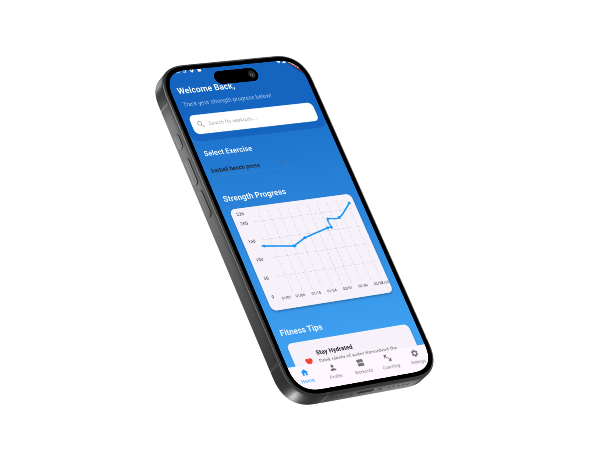
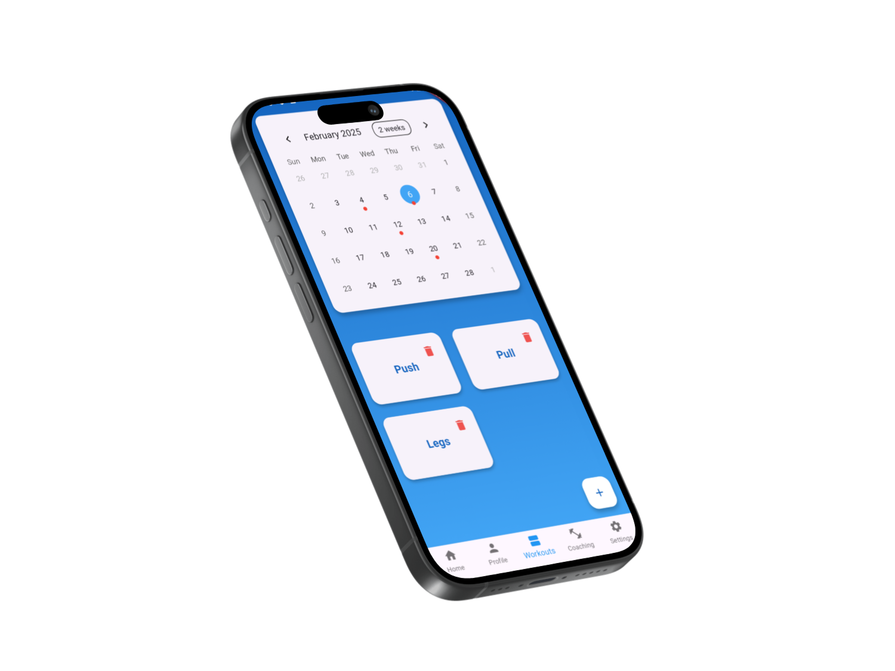
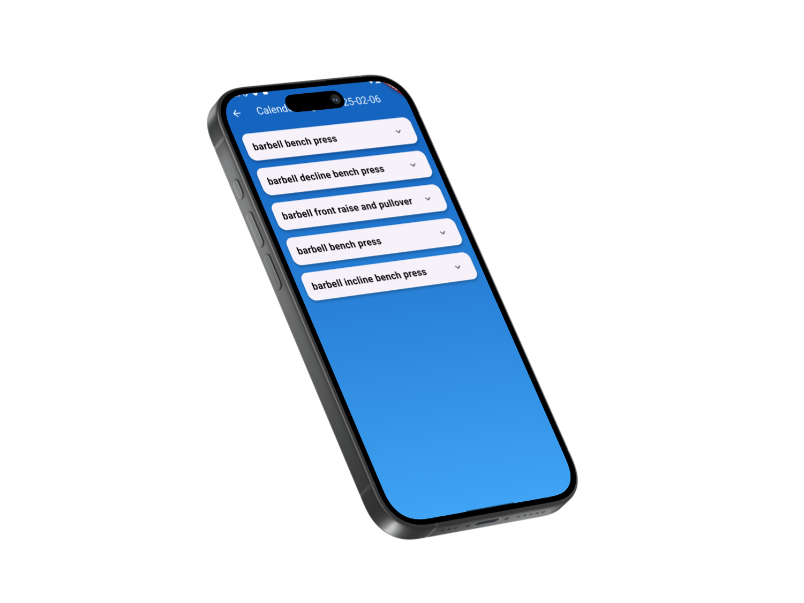
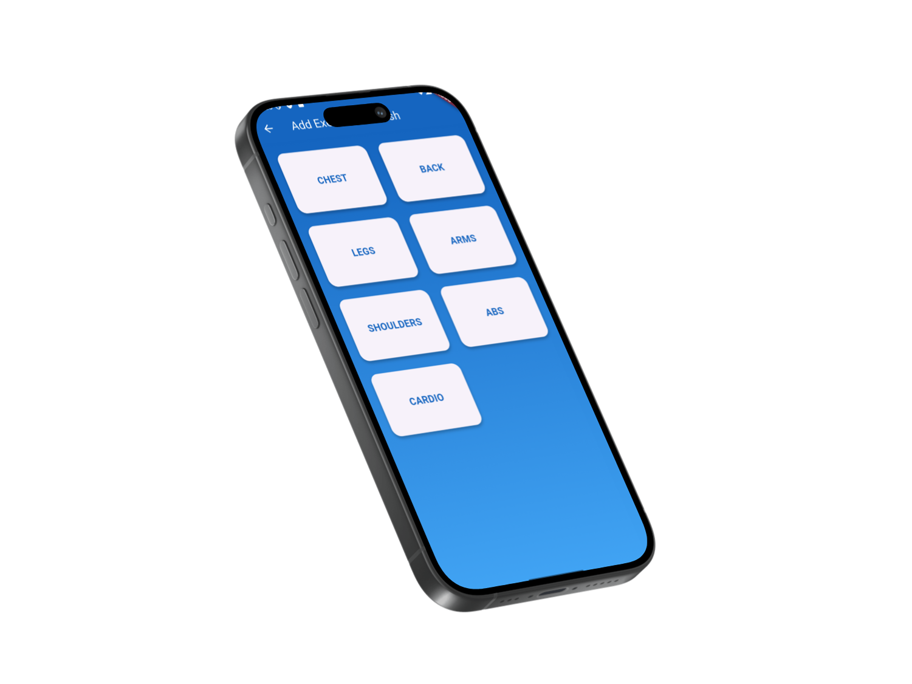
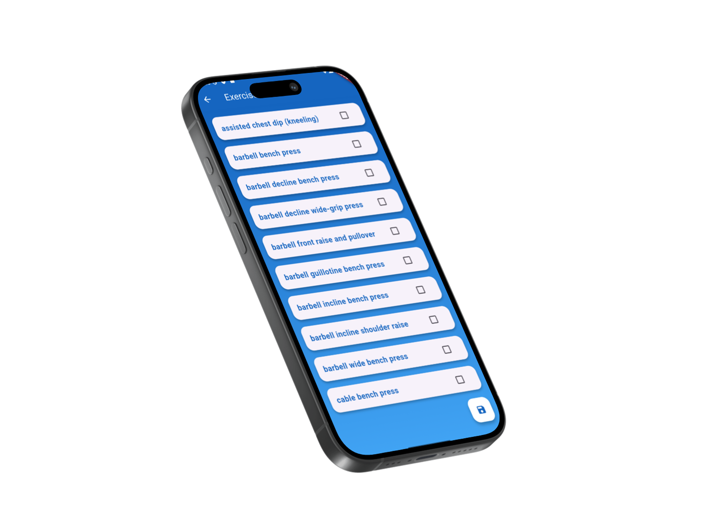
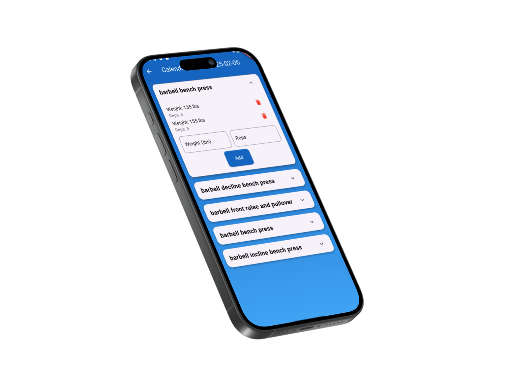
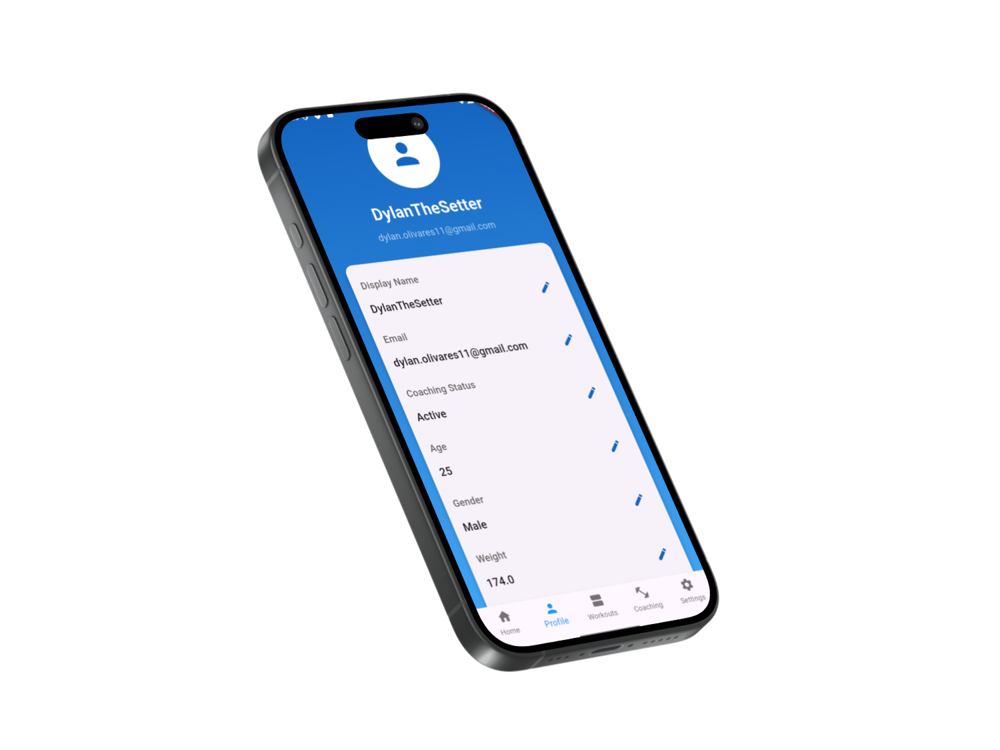

# Fitness Network

Fitness Network is a Flutter-based mobile application designed to help users track their fitness progress, manage workout routines, and log exercise data. The app integrates with Supabase for backend services, including user authentication and data storage.

## Features

- **User Authentication**
- **Exercise Logging**
- **Workout Routine Management**
- **Calendar View for Workout Logs**
- **Profile Management**
- **Settings Page**

## Screenshots

Here are some screenshots of the app:

| Home Page | Calendar View | Workout Routine |
|-----------|---------------|-----------------|
|  |  |  |

| Exercise Logging | Profile Page | Settings Page |
|------------------|--------------|---------------|
|  |  |  |

| Login Page |
|------------|
|  |

## Project File Structure

Below is the file structure of the project:

```
fitness_network/
├── lib/
│   ├── main.dart
│   ├── screens/
│   │   ├── home_screen.dart
│   │   ├── login_screen.dart
│   │   ├── profile_screen.dart
│   │   ├── settings_screen.dart
│   │   └── workout_screen.dart
│   ├── widgets/
│   │   ├── custom_button.dart
│   │   ├── exercise_card.dart
│   │   └── workout_list.dart
│   └── services/
│       ├── auth_service.dart
│       └── database_service.dart
├── assets/
│   ├── images/
│   └── fonts/
├── pubspec.yaml
├── README.md
└── screenshots/
    ├── iphone_1.png
    ├── iphone_2.png
    ├── iphone_3.png
    ├── iphone_4.png
    ├── iphone_5.png
    ├── iphone_6.png
    └── iphone_7.png
```

## Getting Started

### Prerequisites

- Flutter SDK
- Dart SDK
- Supabase account

### Installation

1. Clone the repository:
    ```bash
    git clone https://github.com/yourusername/fitness_network.git
    ```
2. Navigate to the project directory:
    ```bash
    cd fitness_network
    ```
3. Install dependencies:
    ```bash
    flutter pub get
    ```

### Running the App

Connect a device or start an emulator.

Run the app:
```bash
flutter run
```

## Usage

### Authentication

Users can sign up and log in using their email and password. The authentication is handled by Supabase.

### Logging Exercises

Users can log their exercises, including details like weight, reps, and sets. The logs are stored in Supabase.

### Managing Workout Routines

Users can create and manage their workout routines, including adding and removing exercises.

### Viewing Workout Logs

Users can view their workout logs in a calendar view, making it easy to track their progress over time.

### Profile Management

Users can update their profile information, including display name, email, and fitness details.

## Contributing

Contributions are welcome! Please fork the repository and create a pull request with your changes.

## License

This project is licensed under the MIT License.

## Contact

For any questions or feedback, please contact dylan.olivares11@gmail.com.